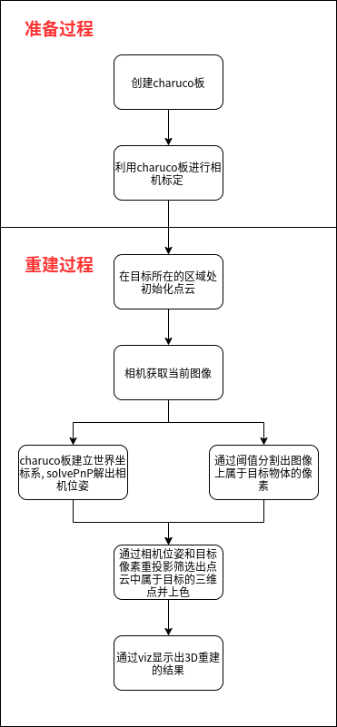

# 3DReconstructionByPointCloud

---
## 代码内容
### charuco_board(charuco板的创建与识别)
### calibration(相机标定)
### segmentation(阈值分割)
### solvePnP(PnP求解)
### reconstruction(重建)
### viz(三维可视化)

---
## 项目架构


1. **创建charuco板**

2. **相机标定**

3. **初始化点云**

4. **建立世界坐标系, solvePnP解出相机位姿**

5. **阈值分割提取目标**

6. **重投影筛选出目标三维点**

7. **viz显示三维重建结果**

---
## 运行环境

ubuntu 18.04

vtk (6.0及以上)

opencv (3.0及以上)

opencv-contrib (opencv同版本)

---
## 编译项目
在项目根目录下

编译后在build文件夹的bin目录里产生可执行文件
```
mkdir build
cd build
cmake ..
make
```

---
## 运行项目
在项目根目录下
```
cd build/bin
./recon -w=5 -d=10 -h=7 -sl=34 -ml=20 -c="camera_params.yml" -dp="detector_params.yml" -ci=1
```
-w charuco板宽的格子数

-h charuco板长的格子数

-d 创建charuco所用的dictionary

-sl suqare 长度, 单位mm

-ml marker 长度, 单位mm

-c 标定得出的相机内参和畸变文件

-dp 识别所用的参数

-ci 调用的摄像头编号

**详细请阅读opencv-contrib aruco中的文档**

---
## 结果演示
三维重建橘子

